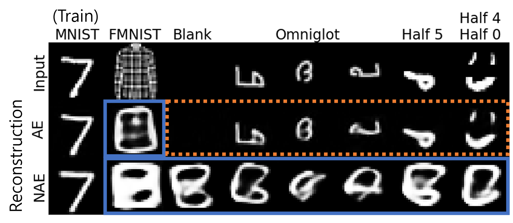

# Autoencoding Under Normalization Constraints

The official repository for &lt;Autoencoding Under Normalization Constraints> (Yoon, Noh and Park, ICML 2021) and **normalized autoencoders**.

> The paper proposes Normalized Autoencoder (NAE), which is a novel energy-based model where the energy function is the reconstruction error. NAE effectively remedies outlier reconstruction, a pathological phenomenon limiting the performance of an autoencoder as an outlier detector.

Paper: https://arxiv.org/abs/2105.05735  
5-min video: https://www.youtube.com/watch?v=ra6usGKnPGk




## News

* 2023-06-15 : Add config file for FashionMNIST
* 2022-06-13 : Refactoring of NAE class.  


## Set-up

### Environment

I encourage you to use conda to set up a virtual environment. However, other methods should work without problems.
```
conda create -n nae python=3.7
```

The main dependencies of the repository is as follows:

- python 3.7.2
- numpy
- pillow
- pytorch 1.7.1
- CUDA 10.1
- scikit-learn 0.24.2
- tensorboard 2.5.0
- pytest 6.2.3


### Datasets

All datasets are stored in `datasets/` directory.

- MNIST, CIFAR-10, SVHN, Omniglot : Retrieved using `torchvision.dataset`.
- Noise, Constant, ConstantGray : [Dropbox link](https://www.dropbox.com/sh/u41ewgwujuvqvpm/AABM6YbklJFAruczJPhBWNwZa?dl=0)
- [CelebA](https://mmlab.ie.cuhk.edu.hk/projects/CelebA.html), [ImageNet 32x32](http://image-net.org/small/download.php): Retrieved from their official site. I am afraid that website for ImageNet 32x32 is not available as of June 24, 2021. I will temporarily upload the data to the above Dropbox link.

When set up, the dataset directory should look like as follows.

```
datasets
├── CelebA
│   ├── Anno
│   ├── Eval
│   └── Img
├── cifar-10-batches-py
├── const_img_gray.npy
├── const_img.npy
├── FashionMNIST
├── ImageNet32
│   ├── train_32x32
│   └── valid_32x32
├── MNIST
├── noise_img.npy
├── omniglot-py
│   ├── images_background
│   └── images_evaluation
├── test_32x32.mat
└── train_32x32.mat

```

### Pre-trained Models

Pre-trained models are stored under `pretrained/`. The pre-trained models are provided through the [Dropbox link](https://www.dropbox.com/sh/u41ewgwujuvqvpm/AABM6YbklJFAruczJPhBWNwZa?dl=0).

If the pretrained models are prepared successfully, the directory structure should look like the following.

```
pretrained
├── celeba64_ood_nae
│   └── z64gr_h32g8
├── cifar_ood_nae
│   └── z32gn
└── mnist_ood_nae
    └── z32
```

## Unittesting

PyTest is used for unittesting.

```
pytest tests
```

The code should pass all tests after the preparation of pre-trained models and datasets.

## Execution 

### OOD Detection Evaluation

```
python evaluate_ood.py --ood ConstantGray_OOD,FashionMNIST_OOD,SVHN_OOD,CelebA_OOD,Noise_OOD --resultdir pretrained/cifar_ood_nae/z32gn/ --ckpt nae_9.pkl --config z32gn.yml --device 0 --dataset CIFAR10_OOD
```

<details>
  <summary>Expected Results</summary>

  ```
  OOD Detection Results in AUC
  ConstantGray_OOD:0.9632
  FashionMNIST_OOD:0.8193
  SVHN_OOD:0.9196
  CelebA_OOD:0.8873
  Noise_OOD:1.0000
  ```
</details>


## Additional Benchmarks on SVHN

We have also provided the additional checkpoints for an SVHN trained dataset [here](https://drive.google.com/file/d/1sG7faE_eqRX0qMoylmxIY6XSWtw6fKlR/view?usp=sharing) and we used those checkpoints in our OOD detection using LID estimates paper. After downloading the checkpoints, make sure to put them in the pretrained directory and then run the following commands:

```bash
# 1. CIFAR10
python evaluate_ood.py --ood SVHN_OOD,CelebA_OOD --resultdir pretrained/cifar_ood_nae/z32gn/ --ckpt nae_9.pkl --config z32gn.yml --device 0 --dataset CIFAR10_OOD
# 2. SVHN
python evaluate_ood.py --ood CIFAR10_OOD,CelebA_OOD --resultdir pretrained/svhn_ood_nae/z32gn/run --ckpt nae_9.pkl --config z32gn.yml --device 0 --dataset SVHN_OOD
# 3. Fashion-MNIST
python evaluate_ood.py --ood MNIST_OOD,Omniglot --resultdir pretrained/fmnist_ood_nae/z32 --ckpt nae_49.pkl --config z32.yml --device 0 --dataset FashionMNIST_OOD
# 4. MNIST
python evaluate_ood.py --ood FashionMNIST_OOD,Omniglot --resultdir pretrained/mnist_ood_nae/z32 --ckpt nae_20.pkl --config z32.yml --device 0 --dataset MNIST_OOD
```

Here are the prompts we use to reproduce the 

## Citation


```
@InProceedings{pmlr-v139-yoon21c,
  title = 	 {Autoencoding Under Normalization Constraints},
  author =       {Yoon, Sangwoong and Noh, Yung-Kyun and Park, Frank},
  booktitle = 	 {Proceedings of the 38th International Conference on Machine Learning},
  pages = 	 {12087--12097},
  year = 	 {2021},
  editor = 	 {Meila, Marina and Zhang, Tong},
  volume = 	 {139},
  series = 	 {Proceedings of Machine Learning Research},
  month = 	 {18--24 Jul},
  publisher =    {PMLR},
  pdf = 	 {http://proceedings.mlr.press/v139/yoon21c/yoon21c.pdf},
  url = 	 {https://proceedings.mlr.press/v139/yoon21c.html}
}
 
```

